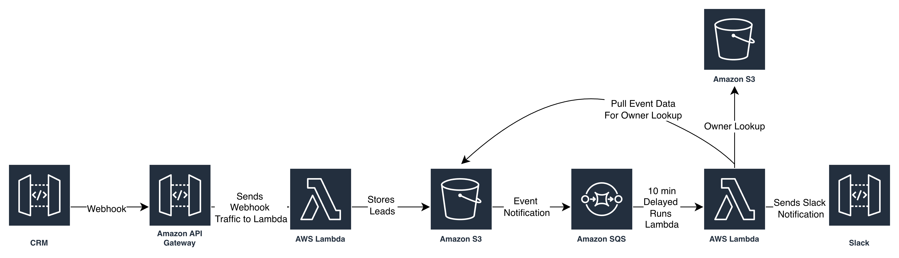
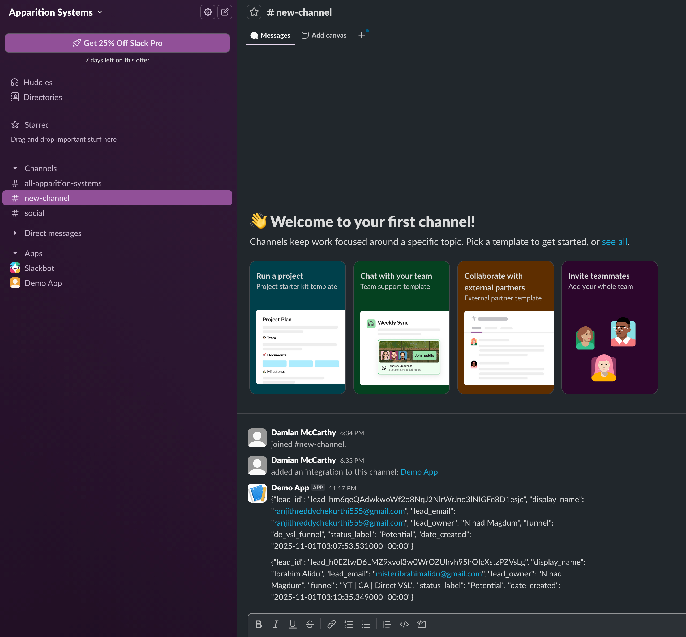

# 
Automated Lead Assignment and Notification System Using AWS and CRM Webhooks

## Problem Statement
In sales-driven organizations, new leads are typically created via a CRM system (Close). However, there is often a lag between lead creation and assignment of a lead owner (sales representative). This delay can create inefficiencies and missed opportunities if leads are not followed up promptly.
This project aims to automate the capture of newly created leads via CRM webhooks, wait for a short buffer period (e.g., 10 minutes), and then assign the correct lead owner based on CRM-updated information. The system must also notify the sales team in real time with enriched lead data via Slack or email.

## Objectives
1. Capture real-time lead creation events using CRM webhook functionality.
2. Store the lead data in Amazon S3 as raw ingestion storage.
3. Introduce a delay (10 minutes) to allow CRM to assign the lead owner.
4. Perform a lookup against another S3 bucket (containing updated lead-owner mappings).
5. Enrich the lead data with the assigned lead owner and store the data in the S3 bucket
6. Send a notification via Slack or email including the lead's name, ID, Created Date, email, lead owner and the funnel.

## Functional Requirements
1. Capture new lead information from CRM webhook in real-time by creating the webhook subscription
2. Store webhook data in JSON format in Amazon S3 bucket source folder after processing the required details from the webhook event. 
3. Implement a 10-minute delay mechanism to provide sufficient time for the CRM system to assign a lead owner before processing the lead further.
4. Lookup recently updated lead owner files in another S3 location. Merge lead and lead owner data using lead_id and store data into the S3 bucket target folders.
5. Send notification with relevant data to the team as notification either on Slack or in an email.

# Deliverables
- README with clear instructions and architecture diagram.
- Modular code for webhook ingestion, lookup and S3 writing.
- Alerts messages in either Slack or email send correctly as per the requirement
- Effective error handling, retries, logging

---

##### Data Source
For the data source we will be receiving a webhook for the CRM on new leads then storing them into S3.

---

##### Storage
The initial section that will store our leads will be S3.

--- 

##### Automation
- Initial Lambda function will store the leads into S3.
- This S3 bucket will have an event trigger for any writes and this will be sent to an SQS queue with a 10 min delay.
- Once the delay has completed the SQS queue will trigger the second lambda that will pull the original data stored in our S3 and use it to get the owner data from the public DEA S3.
- Finally the contents of the Owner file will be sent as a notification to Slack.

---

